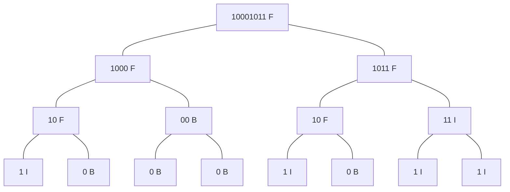

> 本文由Jzwalliser原创，发布在CSDN平台上，遵循[CC 4.0 BY-SA](https://creativecommons.org/licenses/by-sa/4.0/deed.zh-hans)协议。
> 因此，若需转载/引用本文，请注明作者并附原文链接。
> 违者必究，谢谢配合。
> 个人主页：[blog.csdn.net/jzwalliser](https://blog.csdn.net/jzwalliser)
# 题目
洛谷 [P1087 [NOIP2004 普及组] FBI 树](https://www.luogu.com.cn/problem/P1087)

># [NOIP2004 普及组] FBI 树
>
>## 题目描述
>
>我们可以把由 0 和 1 组成的字符串分为三类：全 0 串称为 B 串，全 1 串称为 I 串，既含 0 又含 1 的串则称为 F 串。
>
>FBI 树是一种二叉树，它的结点类型也包括 F 结点，B 结点和 I 结点三种。由一个长度为 $2^N$ 的 01 串 $S$ 可以构造出一棵 FBI 树 $T$，递归的构造方法如下：
>
>1. $T$ 的根结点为 $R$，其类型与串 $S$ 的类型相同；
>2. 若串 $S$ 的长度大于 $1$，将串 $S$ 从中间分开，分为等长的左右子串 $S_1$ 和 $S_2$；由左子串 $S_1$ 构造 $R$ 的左子树 $T_1$，由右子串 $S_2$ 构造 $R$ 的右子树 $T_2$。
>
>现在给定一个长度为 $2^N$ 的 01 串，请用上述构造方法构造出一棵 FBI 树，并输出它的后序遍历序列。
>
>## 输入格式
>
>第一行是一个整数 $N(0 \le N \le 10)$，  
>
>第二行是一个长度为 $2^N$ 的 01 串。
>
>## 输出格式
>
>一个字符串，即 FBI 树的后序遍历序列。
>
>## 样例 #1
>
>### 样例输入 #1
>
>```
>3
>10001011
>```
>
>### 样例输出 #1
>
>```
>IBFBBBFIBFIIIFF
>```
>
>## 提示
>
>对于 $40\%$ 的数据，$N \le 2$；
>
>对于全部的数据，$N \le 10$。
>
>
>noip2004普及组第3题
>
# 想法
题目大意就是，把一个字符串不停地分割成等长的两半，然后建立二叉树，对其进行后序遍历。来解读一下样例。
根据输入，我们可以获得这样的二叉树：

那么，后序遍历输出，就是`IBFBBBFIBFIIIFF`。
不过写程序的时候不需要刻意地、人为地去建立、维护一个二叉树，只需要一个递归函数，并按照一定的顺序输出就可以达到效果。
# 实现
1. 把字符串切成等长的两段，分别递归。
2. 判断字符串类型。
3. 如果当前的字符串只有一个字符那就return。
4. 由于是后序遍历，所以在两次递归操作完成后再输出。

# 题解
## C++
```cpp
#include<iostream>
using namespace std;
string fbi(string str){ //递归建树
    if(str.size() == 1){ //字符串只有一个字符了
        if(str == "1"){ //I串
            cout << "I";
            return "I";
        }
        else{ //B串
            cout << "B";
            return "B";
        }
    }
    else{ //字符串不止一个字符
        string a = fbi(str.substr(0,str.size() / 2)); //处理字符串前半部分
        string b = fbi(str.substr(str.size() / 2,str.size() / 2)); //处理字符串后半部分
        string ftype = a + b;
        if(ftype == "II"){ //如果两个子串都是I串
            cout << "I"; //那么这个字符串也是I串
            return "I";
        }
        else if(ftype == "BB"){ //如果两个子串都是B串
            cout << "B"; //那么这个字符串也是B串
            return "B";
        }
        else{ //否则这个字符串就是F串
            cout << "F";
            return "F";
        }
    }
}
            
int main(){
    int length; //长度
    string str; //字符串
    cin >> length >> str; //输入
    fbi(str); //递归
    return 0;
}
```
## Python
```py
ans = ""
length = input() #获取长度
string = input()[0:2 ** int(length)] #不知道为什么Python不截取字符串会WA，所以这里还是操作一下
def fbi(string): #递归建树
    global ans #将答案存放到ans里面
    if len(string) == 1: #字符串只有一个字符了
        if string == "1": #I串
            ans += "I"
            return "I"
        else: #B串
            ans += "B"
            return "B"
    else: #字符串不止一个字符
        a = fbi(string[0:int(len(string) / 2)]) #处理字符串前半部分
        b = fbi(string[int(len(string) / 2):]) #处理字符串后半部分
        ftype = a + b
        if ftype == "II": #如果两个子串都是I串
            ans += "I" #那么这个字符串也是I串
            return "I"
        elif ftype == "BB": #如果两个子串都是B串
            ans += "B" #那么这个字符串也是B串
            return "B"
        else: #否则这个字符串就是F串
            ans += "F"
            return "F"
fbi(string) #递归
print(ans)
```

# 难度
难度：★☆☆☆☆
这道题其实还好，主要是题目有点难读。需要认真理解才能看懂。之后的操作应该都比较简单吧，递归，输出。

# 结尾
你是怎么想的？欢迎留言！我们下期再见！(˵¯͒〰¯͒˵)


